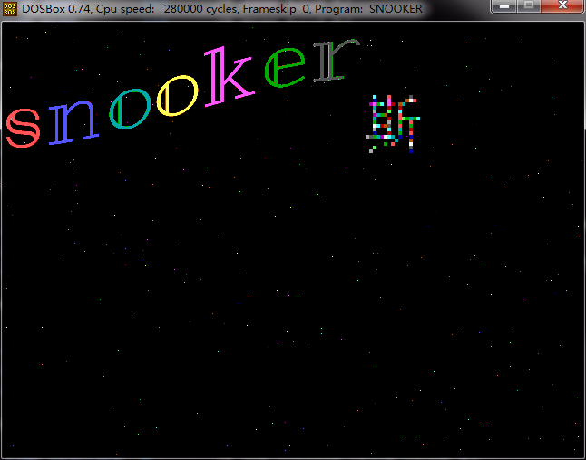
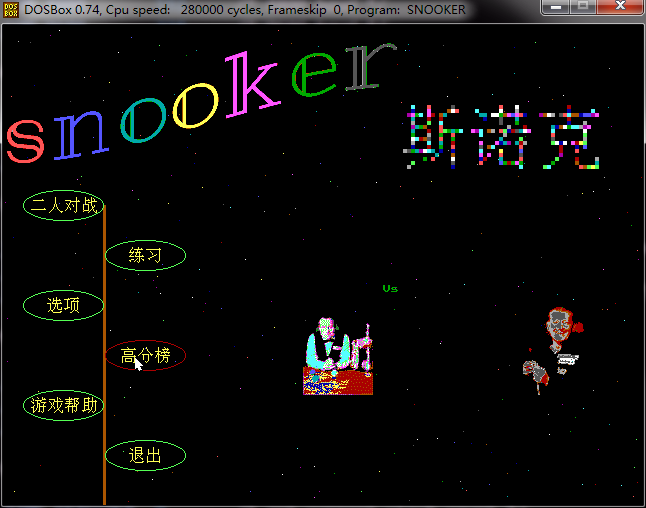
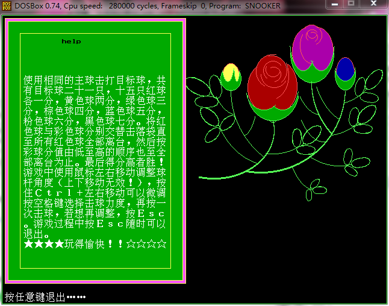
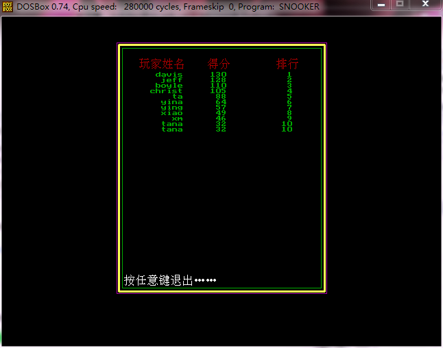
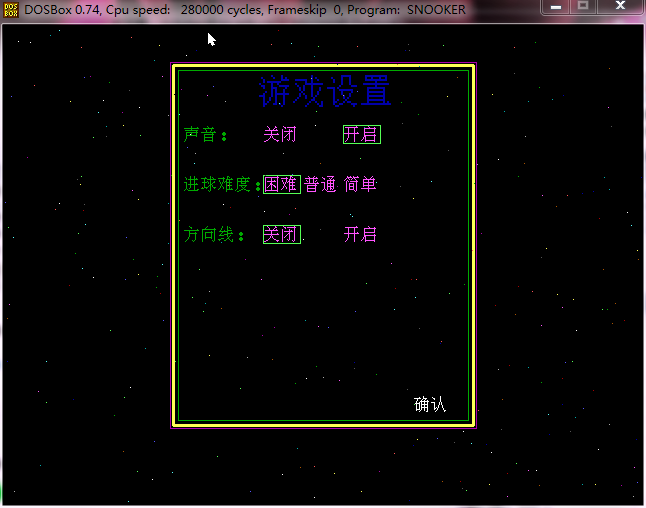
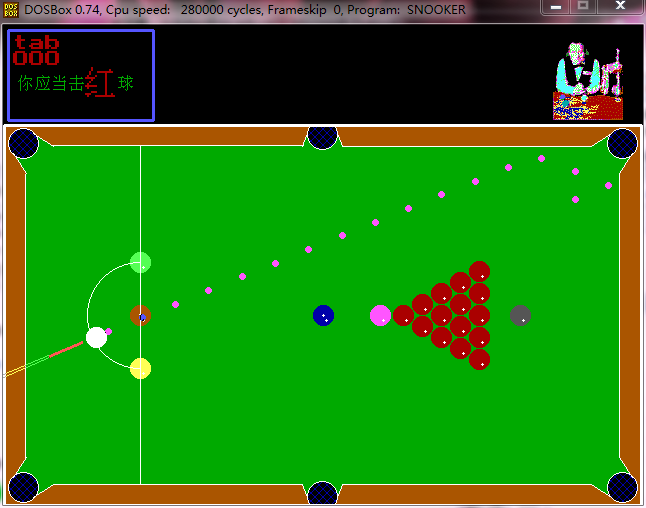

Snooker
====

## 说明

这是一个`TC 2.0`下的斯诺克游戏，本人2009年C语言大程作业。

## 编译指南

- **环境：**DOS
- **编译：**TC 2.0
    
    在 cmd 下将路径引导到当前目录，用命令启动 `TC`，在 `TC`中找到并打开 snooker.c，然后 `Ctrl+F9`即可运行！
    _source_ 下包含一些程序用到的图片、字体等，请不要移动它们。

## 贡献者

- 汪航勋（[后山大鸟](https://github.com/backmountainbird))
- 林远骥
- 黄懿可

## 截图

## License

`MIT`
